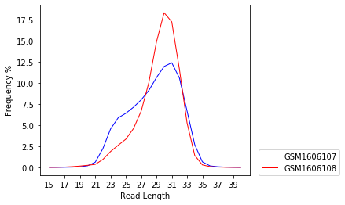
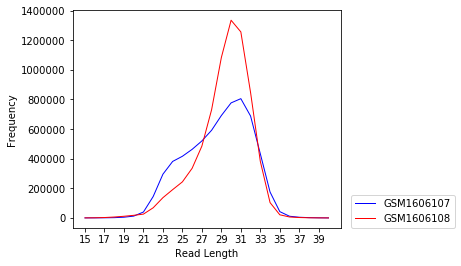
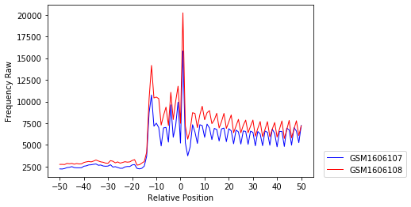
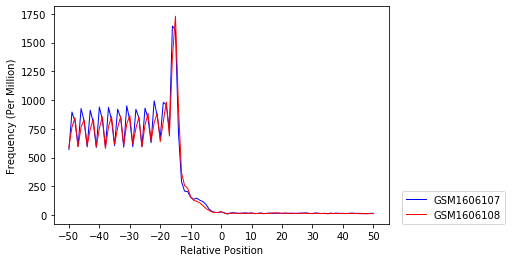
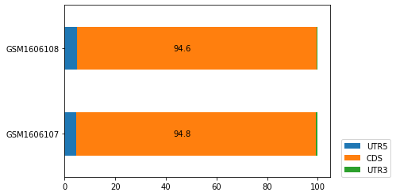

A Walk-through of RiboPy API
============================

**Contents:**

-  `Introduction <#introduction>`__

   -  `Transcript Regions <#transcript-regions>`__

-  `Installation <#installation>`__

   -  `pip <#pip>`__
   -  `Conda <#conda>`__
   -  `From the Source Code <#from-the-source-code>`__

-  `Getting Started <#getting-started>`__

   -  `Generating a Ribo Object <#generating-a-ribo-object>`__

-  `Length Distribution <#length-distribution>`__
-  `Metagene Analysis <#metagene-analysis>`__

   -  `A Note on Aggregating the
      Output <#a-note-on-aggregating-the-output>`__

-  `Region Counts <#region-counts>`__
-  `Advanced Features <#advanced-features>`__

   -  `Alias <#alias>`__
   -  `Object Attributes <#object-attributes>`__

-  `Optional Data <#optional-data>`__

   -  `Metadata <#metadata>`__
   -  `Coverage <#coverage>`__
   -  `RNA-Seq <#rna-seq>`__

Introduction
------------

`Ribosome Profiling <https://www.nature.com/articles/nrg3645>`__ is a
sequencing based method to study protein synthesis transcriptome-wide.
Actively translating mRNAs are engaged with ribosomes and protein
synthesis rates can be approximated by the number of ribosomes that are
translating a given mRNA. Ribosome profiling employs an RNase digestion
step to recover fragments of RNA protected by ribosomes which are called
**Ribosome Protected Footprints (RPFs)**.

Ribosome profiling data analyses involve several quantifications for
each transcript. Specifically, the lengths of the RPFs provide valuable
biological information (see, for example, `Lareau et
al. <https://elifesciences.org/articles/01257>`__ and `Wu et
al. <https://www.sciencedirect.com/science/article/pii/S1097276518310633?via%3Dihub>`__).
To facilitate ribosome profiling data analyses as a function of RPF
length in a highly efficient manner, we implemented a new data format,
called
`ribo <https://ribopy.readthedocs.io/en/latest/ribo_file_format.html>`__.
Files in ribo format are called **.ribo** files.

RiboPy package is an Python interface for .ribo files. The package
offers a suite of reading functions for .ribo files, and provides
plotting functions that are most often employed in ribosome profiling
analyses. Using RiboPy, one can import .ribo files into the Python
environment, read ribosome profiling data into pandas data frames and
generate essential plots in a few lines of Python code.

This document is structured into several sections. First, we give an
overview of the Ribo File format and define transcript regions. Second,
we provide instructions and requirements for the installation of RiboPy.
Third, we describe how to import a .ribo file to the Python environment
and demonstrate essential ribosome profiling data analyses in three
sections:

-  `Length Distribution <#length-distribution>`__
-  `Metagene Analysis <#metagene-analysis>`__
-  `Region Counts <#region-counts>`__

In the last two sections, we describe some advanced features including
renaming transcripts using aliases, accessing .ribo file attributes, and
getting region boundaries that define transcript regions. In the last
section, we explain the three optional types of data, which may exist in
a .ribo file.

-  Metadata: A .ribo file may contain metadata for each experiment and
   for the .ribo file itself.
-  Coverage: A .ribo file can keep the nucleotide level transcriptome
   coverage.
-  RNA-Seq: A ribosome profiling experiment can be paired with an
   RNA-Seq experiment to study ribosome occupancy together with
   transcript abundance.

.ribo File Format 
~~~~~~~~~~~~~~~~~~

.ribo files are built on an
`HDF5 <https://www.hdfgroup.org/solutions/hdf5/>`__ architecture and has
a predefined internal structure (Figure 1). For a more detailed
explanation of the ribo format, we refer to the `readthedocs page of
ribo <https://ribopy.readthedocs.io/en/latest/ribo_file_format.html>`__.

|Figure 1 ribo File Internal Structure|

.. raw:: html

   

Figure 1: ribo File Internal Structure

.. raw:: html

   

While many features are required in .ribo files, quantification from
paired RNA-Seq data and nucleotide-level coverage are optional.

Transcript Regions
~~~~~~~~~~~~~~~~~~

The main protein coding region of a transcript is called the coding
sequence (CDS). Its boundaries are called transcription start / stop
sites. The region consisting of the nucleotides, between the 5’ end of
the transcript and the start site, not translated to protein, is called
5’ untranslated region (5’UTR). Similarly, the region having the
nucleotides between the stop site and the 3’ end of the transcript, is
called 3’ untranslated region (3’UTR). To avoid strings and variable
names starting with a number and containing an apostrophe character, we
use the names UTR5 and UTR3 instead of 5’UTR and 3’UTR respectively.

Installation 
-------------

RiboPy requires Python version 3.6 or higher.

Availability
~~~~~~~~~~~~

The source code of RiboPy package is available in a `public Github
repository <https://github.com/ribosomeprofiling/ribopy>`__.

Pip
~~~

RiboPy can be install via pip:

::

      pip install ribopy

Conda
~~~~~

It is recommended to install RiboPy in a separate conda environment. For
this, install conda first by following the instructions
`here <https://conda.io/projects/conda/en/latest/user-guide/install/index.html>`__.

The following commands will download an environment file, called
enviroenment.yaml, and install RiboPy inside a conda environmen named
*ribo*.

::

   wget https://github.com/ribosomeprofiling/riboflow/blob/master/environment.yaml
   conda env create -f environment.yml

From the Source Code
~~~~~~~~~~~~~~~~~~~~

::

      pip install git+https://github.com/ribosomeprofiling/ribopy.git

.. |Figure 1 ribo File Internal Structure| image:: https://ribopy.readthedocs.io/en/latest/_images/ribo_file_structure.jpg

.. code:: ipython3

    # Some formatting forthe rest of the notebook
    from IPython.core.display import HTML
    HTML("""
    
    """)

.. raw:: html

    
    

Getting Started
---------------

First, we download a sample ribo file.

.. code:: ipython3

    ! wget https://github.com/ribosomeprofiling/ribo_manuscript_supplemental/raw/master/sidrauski_et_al/ribo/without_coverage/all.ribo

.. parsed-literal::

    --2019-12-19 13:20:57--  https://github.com/ribosomeprofiling/ribo_manuscript_supplemental/raw/master/sidrauski_et_al/ribo/without_coverage/all.ribo
    Resolving github.com (github.com)... 140.82.113.3
    Connecting to github.com (github.com)|140.82.113.3|:443... connected.
    HTTP request sent, awaiting response... 302 Found
    Location: https://raw.githubusercontent.com/ribosomeprofiling/ribo_manuscript_supplemental/master/sidrauski_et_al/ribo/without_coverage/all.ribo [following]
    --2019-12-19 13:20:58--  https://raw.githubusercontent.com/ribosomeprofiling/ribo_manuscript_supplemental/master/sidrauski_et_al/ribo/without_coverage/all.ribo
    Resolving raw.githubusercontent.com (raw.githubusercontent.com)... 151.101.48.133
    Connecting to raw.githubusercontent.com (raw.githubusercontent.com)|151.101.48.133|:443... connected.
    HTTP request sent, awaiting response... 200 OK
    Length: 44518345 (42M) [application/octet-stream]
    Saving to: ‘all.ribo.9’
    
    all.ribo.9          100%[===================>]  42.46M  94.4MB/s    in 0.4s    
    
    2019-12-19 13:20:59 (94.4 MB/s) - ‘all.ribo.9’ saved [44518345/44518345]
    

Next, we import the ribopy package

.. code:: ipython3

    import ribopy
    %matplotlib inline

Generating a Ribo Object 
~~~~~~~~~~~~~~~~~~~~~~~~~

To interact with a .ribo file, it is necessary to create a ribo object
that provides a direct handle to the file and displays its various
attributes. As an example, we processed publicly available ribosome
profiling data (GEO accession number
`GSE65778 <https://www.ncbi.nlm.nih.gov/geo/query/acc.cgi?acc=GSE65778>`__)
from HEK293 cells using
`RiboFlow <https://github.com/ribosomeprofiling/riboflow>`__ pipeline to
generate the .ribo file in this document. More precisely, we picked two
ribosome profiling experiments coming from untreated HEK293 cells
(accession numbers: GSM1606107 and GSM1606108) and two RNA-Seq
experiments coming from the same line of untreated cells (accession
numbers: GSM1606099 and GSM1606100). Each ribo experiment can be paired
with a single RNA-Seq experiment. So we arbitrarily paired the ribosome
profiling experiment GSM1606107 with RNA-Seq experiment GSM1606099 and
GSM1606108 with GSM1606100, when making the example .ribo file in this
document.

.. code:: ipython3

    # Import the Ribo Object from the RiboPy package
    from ribopy import Ribo
    
    ribo_path   = "all.ribo"
    ribo_object = Ribo(ribo_path, alias = ribopy.api.alias.apris_human_alias)

Once the ribo object is created, we can inquire about the contents of
the .ribo file by calling the ``print_info`` method.

.. code:: ipython3

    ribo_object.print_info()

.. parsed-literal::

    Ribo File Info:
    ---------------
    Ribo File Version : 1.0
    RiboPy Version    : 0.0.0
    Creation Time     : 2019-11-03 13:31:16
    Reference         : appris-v1
    Min Read Length   : 15
    Max Read Length   : 40
    Metagene Radius   : 50
    Left Span         : 35
    Right Span        : 10
    
    Experiments:
    ------------ 
    Name          Reads  Coverage  RNA-Seq  Metadata
    GSM1606107  7243990         *        *         *
    GSM1606108  8175863         *        *         *

The above output provides information about the individual experiments
that are contained in the given ribo object. In addition, this output
displays some of the parameters, that were used in generating the .ribo
file, such as left span, right span and metagene radius.

For a detailed explanation of the contents of this output, we refer to
the `online documentation of the ribo
format <https://ribopy.readthedocs.io/en/latest/ribo_file_format.html>`__.

In what follows, we demonstrate a typical exploration of ribosome
profiling data. We start with the length distribution of RPFs.

Length Distribution 
--------------------

Several experimental decisions including the choice of RNase can have a
significant impact on the RPF length distribution. In addition, this
information is generally informative about the quality of the ribosome
profiling data.

We use the method ``plot_lengthdist`` to generate the distribution of
the reads mapping to a specific region. This method has also a boolean
argument called ``normalize``. When normalize is False, the y-axis
displays the total number of reads mapping to the specified region. When
fraction is True, the y-axis displays the quotient of the same number as
above divided by the total number of reads reported in the experiment.

The following code plots the coding region mapping RPF length
distribution.

.. code:: ipython3

    ribo_object.plot_lengthdist(region_type = "CDS",
                                normalize   = True,
                                experiments = ["GSM1606107", "GSM1606108"])

We can also plot the absolute number of reads instead of the fraction of
total reads by changing the argument ``normalize = False``.

.. code:: ipython3

    ribo_object.plot_lengthdist(region_type = "CDS",
                                normalize   = False,
                                experiments = ["GSM1606107", "GSM1606108"])

We can extract the numerical values used to produce the above plot using
the method ``get_length_dist`` as follows. The parameters of this method
will be explained in more detail later in this document.

.. code:: ipython3

    ribo_object.get_length_dist(region_name = "CDS",
                                experiments = ["GSM1606107", "GSM1606108"])

.. raw:: html

    

    
    <table border="1" class="dataframe">
      <thead>
        <tr style="text-align: right;">
          <th></th>
          <th>GSM1606107</th>
          <th>GSM1606108</th>
        </tr>
        <tr>
          <th>read_length</th>
          <th></th>
          <th></th>
        </tr>
      </thead>
      <tbody>
        <tr>
          <th>15</th>
          <td>356</td>
          <td>375</td>
        </tr>
        <tr>
          <th>16</th>
          <td>591</td>
          <td>975</td>
        </tr>
        <tr>
          <th>17</th>
          <td>1023</td>
          <td>2742</td>
        </tr>
        <tr>
          <th>18</th>
          <td>1911</td>
          <td>6232</td>
        </tr>
        <tr>
          <th>19</th>
          <td>4913</td>
          <td>11228</td>
        </tr>
        <tr>
          <th>20</th>
          <td>12320</td>
          <td>17668</td>
        </tr>
        <tr>
          <th>21</th>
          <td>39946</td>
          <td>25851</td>
        </tr>
        <tr>
          <th>22</th>
          <td>144577</td>
          <td>68636</td>
        </tr>
        <tr>
          <th>23</th>
          <td>295417</td>
          <td>136887</td>
        </tr>
        <tr>
          <th>24</th>
          <td>381679</td>
          <td>191180</td>
        </tr>
        <tr>
          <th>25</th>
          <td>416440</td>
          <td>243588</td>
        </tr>
        <tr>
          <th>26</th>
          <td>463286</td>
          <td>335312</td>
        </tr>
        <tr>
          <th>27</th>
          <td>519931</td>
          <td>485204</td>
        </tr>
        <tr>
          <th>28</th>
          <td>592263</td>
          <td>731238</td>
        </tr>
        <tr>
          <th>29</th>
          <td>691477</td>
          <td>1083531</td>
        </tr>
        <tr>
          <th>30</th>
          <td>777003</td>
          <td>1335167</td>
        </tr>
        <tr>
          <th>31</th>
          <td>805545</td>
          <td>1256402</td>
        </tr>
        <tr>
          <th>32</th>
          <td>688211</td>
          <td>846807</td>
        </tr>
        <tr>
          <th>33</th>
          <td>433219</td>
          <td>382410</td>
        </tr>
        <tr>
          <th>34</th>
          <td>175091</td>
          <td>103662</td>
        </tr>
        <tr>
          <th>35</th>
          <td>42656</td>
          <td>21265</td>
        </tr>
        <tr>
          <th>36</th>
          <td>11418</td>
          <td>6420</td>
        </tr>
        <tr>
          <th>37</th>
          <td>4701</td>
          <td>2776</td>
        </tr>
        <tr>
          <th>38</th>
          <td>2021</td>
          <td>1084</td>
        </tr>
        <tr>
          <th>39</th>
          <td>847</td>
          <td>451</td>
        </tr>
        <tr>
          <th>40</th>
          <td>237</td>
          <td>153</td>
        </tr>
      </tbody>
    </table>
    

Metagene Analysis
-----------------

A common quality control step in ribosome profiling analyses is the
inspection of the pileup of sequencing reads with respect to the start
and stop site of annotated coding regions. Given that ribosomes are
predominantly translating annotated coding regions, these plots are
informative about the enrichment at the boundaries of coding regions and
also provide information regarding the periodicity of aligned sequencing
reads. This type of plot is called a metagene plot as the reads are
aggregated around translation start and stop sites across all
transcripts.

The parameter “metagene radius” is the number of nucleotides surrounding
the start/stop site and hence defines the region of analysis. For each
position, read counts are aggregated across transcripts. This cumulative
read coverage (y-axis) is plotted as a function of the position relative
to the start/stop site (x-axis).

``metagene_radius`` attribute of the ribo object gives us the metagene
radius.

.. code:: ipython3

    ribo_object.metagene_radius

.. parsed-literal::

    50

We can plot the ribosome occupancy around the start or stop sites using
plot_metagene. The following code produces the metagene plot at the
start site for the experiments GSM1606107 and GSM1606108. The values on
the y-axis are the raw read counts.

.. code:: ipython3

    ribo_object.plot_metagene(site_type   = "start",
                              experiments = ["GSM1606107", "GSM1606108"],
                              range_lower = 15,
                              range_upper = 40)

To better compare these experiments, we can normalize the coverage by
setting ``normalize = True``. In the following example, in addition to
these parameters, we set ``site_type = "stop"`` to see the stop site
coverage.

.. code:: ipython3

    ribo_object.plot_metagene(site_type   = "stop",
                              experiments = ["GSM1606107", "GSM1606108"],
                              normalize   = True,
                              range_lower = 15,
                              range_upper = 40)

The method ``get_metagene`` can be used to read the metagene data into a
`pandas data
frame <https://pandas.pydata.org/pandas-docs/stable/reference/api/pandas.DataFrame.html>`__.
When using ``sum_lengths = True`` and ``sum_references = True``, the
user will obtain the most concise data corresponding to the sum of reads
surrounding the start / stop site across all read lengths and
transcripts. As a result, one row of values will be reported for each
experiment.

.. code:: ipython3

    metagene_start = \
       ribo_object.get_metagene(site_type      = "start",
                                range_lower    = 15,
                                range_upper    = 40,
                                sum_lengths    = True,
                                sum_references = True
                            )
    # In the column indeces, 0 corresponds to the start site
    # The entire dataframe is too wide. So we display 
    # the 5 nucleotides to the right and the left of the
    # start site.
    
    metagene_start[range(-5,6)]

.. raw:: html

    

    
    <table border="1" class="dataframe">
      <thead>
        <tr style="text-align: right;">
          <th></th>
          <th>-5</th>
          <th>-4</th>
          <th>-3</th>
          <th>-2</th>
          <th>-1</th>
          <th>0</th>
          <th>1</th>
          <th>2</th>
          <th>3</th>
          <th>4</th>
          <th>5</th>
        </tr>
        <tr>
          <th>experiment</th>
          <th></th>
          <th></th>
          <th></th>
          <th></th>
          <th></th>
          <th></th>
          <th></th>
          <th></th>
          <th></th>
          <th></th>
          <th></th>
        </tr>
      </thead>
      <tbody>
        <tr>
          <th>GSM1606107</th>
          <td>5326</td>
          <td>9618</td>
          <td>5889</td>
          <td>7221</td>
          <td>9928</td>
          <td>5211</td>
          <td>15829</td>
          <td>5247</td>
          <td>3747</td>
          <td>4778</td>
          <td>7330</td>
        </tr>
        <tr>
          <th>GSM1606108</th>
          <td>7250</td>
          <td>11066</td>
          <td>7925</td>
          <td>10034</td>
          <td>11769</td>
          <td>7491</td>
          <td>20228</td>
          <td>7192</td>
          <td>5662</td>
          <td>6742</td>
          <td>8715</td>
        </tr>
      </tbody>
    </table>
    

To maintain the counts at each individual read length summed across
transcripts, use ``sum_lengths = True`` and ``sum_references = False``.
If the metagene data of a single read length, say 30, is needed, set
``range_lower`` and ``range_lower`` to 30.

.. code:: ipython3

    metagene_start_trans = \
       ribo_object.get_metagene(site_type      = "start",
                                range_lower    = 30,
                                range_upper    = 30,
                                sum_lengths    = True,
                                sum_references = False,
                                alias          = True
                               )
    metagene_start_trans[range(-5,6)]

.. raw:: html

    

    
    <table border="1" class="dataframe">
      <thead>
        <tr style="text-align: right;">
          <th></th>
          <th></th>
          <th>-5</th>
          <th>-4</th>
          <th>-3</th>
          <th>-2</th>
          <th>-1</th>
          <th>0</th>
          <th>1</th>
          <th>2</th>
          <th>3</th>
          <th>4</th>
          <th>5</th>
        </tr>
        <tr>
          <th>experiment</th>
          <th>transcript</th>
          <th></th>
          <th></th>
          <th></th>
          <th></th>
          <th></th>
          <th></th>
          <th></th>
          <th></th>
          <th></th>
          <th></th>
          <th></th>
        </tr>
      </thead>
      <tbody>
        <tr>
          <th rowspan="5" valign="top">GSM1606107</th>
          <th>OR4F5-201</th>
          <td>0</td>
          <td>0</td>
          <td>0</td>
          <td>0</td>
          <td>0</td>
          <td>0</td>
          <td>0</td>
          <td>0</td>
          <td>0</td>
          <td>0</td>
          <td>0</td>
        </tr>
        <tr>
          <th>OR4F29-201</th>
          <td>0</td>
          <td>0</td>
          <td>0</td>
          <td>0</td>
          <td>0</td>
          <td>0</td>
          <td>0</td>
          <td>0</td>
          <td>0</td>
          <td>0</td>
          <td>0</td>
        </tr>
        <tr>
          <th>OR4F16-201</th>
          <td>0</td>
          <td>0</td>
          <td>0</td>
          <td>0</td>
          <td>0</td>
          <td>0</td>
          <td>0</td>
          <td>0</td>
          <td>0</td>
          <td>0</td>
          <td>0</td>
        </tr>
        <tr>
          <th>SAMD11-202</th>
          <td>0</td>
          <td>0</td>
          <td>0</td>
          <td>0</td>
          <td>0</td>
          <td>0</td>
          <td>0</td>
          <td>0</td>
          <td>0</td>
          <td>0</td>
          <td>0</td>
        </tr>
        <tr>
          <th>NOC2L-201</th>
          <td>0</td>
          <td>1</td>
          <td>1</td>
          <td>0</td>
          <td>1</td>
          <td>1</td>
          <td>1</td>
          <td>0</td>
          <td>0</td>
          <td>0</td>
          <td>1</td>
        </tr>
        <tr>
          <th>...</th>
          <th>...</th>
          <td>...</td>
          <td>...</td>
          <td>...</td>
          <td>...</td>
          <td>...</td>
          <td>...</td>
          <td>...</td>
          <td>...</td>
          <td>...</td>
          <td>...</td>
          <td>...</td>
        </tr>
        <tr>
          <th rowspan="5" valign="top">GSM1606108</th>
          <th>MT-CO2-201</th>
          <td>0</td>
          <td>0</td>
          <td>0</td>
          <td>0</td>
          <td>0</td>
          <td>0</td>
          <td>1</td>
          <td>0</td>
          <td>0</td>
          <td>1</td>
          <td>0</td>
        </tr>
        <tr>
          <th>MT-ATP8-201</th>
          <td>0</td>
          <td>0</td>
          <td>0</td>
          <td>0</td>
          <td>0</td>
          <td>0</td>
          <td>1</td>
          <td>0</td>
          <td>0</td>
          <td>0</td>
          <td>0</td>
        </tr>
        <tr>
          <th>MT-ATP6-201</th>
          <td>0</td>
          <td>0</td>
          <td>0</td>
          <td>0</td>
          <td>0</td>
          <td>0</td>
          <td>0</td>
          <td>0</td>
          <td>0</td>
          <td>0</td>
          <td>0</td>
        </tr>
        <tr>
          <th>MT-ND4L-201</th>
          <td>0</td>
          <td>0</td>
          <td>0</td>
          <td>0</td>
          <td>0</td>
          <td>0</td>
          <td>0</td>
          <td>1</td>
          <td>0</td>
          <td>0</td>
          <td>0</td>
        </tr>
        <tr>
          <th>MT-ND5-201</th>
          <td>0</td>
          <td>0</td>
          <td>0</td>
          <td>0</td>
          <td>0</td>
          <td>1</td>
          <td>1</td>
          <td>1</td>
          <td>1</td>
          <td>1</td>
          <td>1</td>
        </tr>
      </tbody>
    </table>
    
39644 rows × 11 columns

    

If we wish to preserve the read counts for individual transcript sum
across a range of read lengths, we set ``sum_references = False`` and
``sum_lengths = True``. While it is possible to set
``sum_references = False`` and ``sum_lengths = False``, run times might
be slower for this option, and running the method with these options
requires a substantial amount of memory.

.. code:: ipython3

    metagene_start_length = \
        ribo_object.get_metagene(site_type      = "start",
                                range_lower    = 15,
                                range_upper    = 40,
                                sum_lengths    = False,
                                sum_references = True,
                                alias          = True
                               )
    
    # The entire dataframe gives metagene data for both experiments
    # from the relative positions -50 to 50. 
    # Here we restrict our attention to one experiment: GSM1606107
    # and the positions -5 to 5 by slicing the data frame.
    metagene_start_length.loc["GSM1606107"][range(-5,6)]

.. raw:: html

    

    
    <table border="1" class="dataframe">
      <thead>
        <tr style="text-align: right;">
          <th></th>
          <th>-5</th>
          <th>-4</th>
          <th>-3</th>
          <th>-2</th>
          <th>-1</th>
          <th>0</th>
          <th>1</th>
          <th>2</th>
          <th>3</th>
          <th>4</th>
          <th>5</th>
        </tr>
        <tr>
          <th>read_length</th>
          <th></th>
          <th></th>
          <th></th>
          <th></th>
          <th></th>
          <th></th>
          <th></th>
          <th></th>
          <th></th>
          <th></th>
          <th></th>
        </tr>
      </thead>
      <tbody>
        <tr>
          <th>15</th>
          <td>0</td>
          <td>0</td>
          <td>0</td>
          <td>0</td>
          <td>0</td>
          <td>0</td>
          <td>1</td>
          <td>0</td>
          <td>0</td>
          <td>2</td>
          <td>1</td>
        </tr>
        <tr>
          <th>16</th>
          <td>1</td>
          <td>0</td>
          <td>0</td>
          <td>1</td>
          <td>0</td>
          <td>0</td>
          <td>1</td>
          <td>0</td>
          <td>1</td>
          <td>1</td>
          <td>0</td>
        </tr>
        <tr>
          <th>17</th>
          <td>0</td>
          <td>2</td>
          <td>0</td>
          <td>3</td>
          <td>1</td>
          <td>0</td>
          <td>6</td>
          <td>0</td>
          <td>0</td>
          <td>3</td>
          <td>1</td>
        </tr>
        <tr>
          <th>18</th>
          <td>2</td>
          <td>3</td>
          <td>1</td>
          <td>1</td>
          <td>0</td>
          <td>3</td>
          <td>16</td>
          <td>3</td>
          <td>4</td>
          <td>5</td>
          <td>1</td>
        </tr>
        <tr>
          <th>19</th>
          <td>0</td>
          <td>4</td>
          <td>0</td>
          <td>4</td>
          <td>17</td>
          <td>12</td>
          <td>42</td>
          <td>4</td>
          <td>4</td>
          <td>8</td>
          <td>12</td>
        </tr>
        <tr>
          <th>20</th>
          <td>3</td>
          <td>6</td>
          <td>6</td>
          <td>43</td>
          <td>55</td>
          <td>32</td>
          <td>105</td>
          <td>11</td>
          <td>10</td>
          <td>30</td>
          <td>22</td>
        </tr>
        <tr>
          <th>21</th>
          <td>16</td>
          <td>28</td>
          <td>66</td>
          <td>206</td>
          <td>89</td>
          <td>50</td>
          <td>375</td>
          <td>16</td>
          <td>20</td>
          <td>55</td>
          <td>32</td>
        </tr>
        <tr>
          <th>22</th>
          <td>61</td>
          <td>228</td>
          <td>295</td>
          <td>484</td>
          <td>209</td>
          <td>181</td>
          <td>710</td>
          <td>84</td>
          <td>42</td>
          <td>99</td>
          <td>127</td>
        </tr>
        <tr>
          <th>23</th>
          <td>259</td>
          <td>460</td>
          <td>409</td>
          <td>484</td>
          <td>327</td>
          <td>259</td>
          <td>926</td>
          <td>155</td>
          <td>63</td>
          <td>154</td>
          <td>236</td>
        </tr>
        <tr>
          <th>24</th>
          <td>350</td>
          <td>483</td>
          <td>350</td>
          <td>426</td>
          <td>345</td>
          <td>293</td>
          <td>950</td>
          <td>169</td>
          <td>100</td>
          <td>179</td>
          <td>253</td>
        </tr>
        <tr>
          <th>25</th>
          <td>289</td>
          <td>424</td>
          <td>257</td>
          <td>379</td>
          <td>326</td>
          <td>258</td>
          <td>842</td>
          <td>158</td>
          <td>106</td>
          <td>174</td>
          <td>228</td>
        </tr>
        <tr>
          <th>26</th>
          <td>247</td>
          <td>377</td>
          <td>241</td>
          <td>338</td>
          <td>352</td>
          <td>234</td>
          <td>844</td>
          <td>178</td>
          <td>99</td>
          <td>184</td>
          <td>245</td>
        </tr>
        <tr>
          <th>27</th>
          <td>250</td>
          <td>373</td>
          <td>240</td>
          <td>354</td>
          <td>377</td>
          <td>270</td>
          <td>908</td>
          <td>151</td>
          <td>119</td>
          <td>218</td>
          <td>273</td>
        </tr>
        <tr>
          <th>28</th>
          <td>324</td>
          <td>453</td>
          <td>280</td>
          <td>457</td>
          <td>530</td>
          <td>289</td>
          <td>1087</td>
          <td>250</td>
          <td>169</td>
          <td>304</td>
          <td>356</td>
        </tr>
        <tr>
          <th>29</th>
          <td>555</td>
          <td>616</td>
          <td>419</td>
          <td>739</td>
          <td>670</td>
          <td>393</td>
          <td>1587</td>
          <td>320</td>
          <td>293</td>
          <td>531</td>
          <td>495</td>
        </tr>
        <tr>
          <th>30</th>
          <td>718</td>
          <td>838</td>
          <td>721</td>
          <td>912</td>
          <td>931</td>
          <td>659</td>
          <td>1840</td>
          <td>482</td>
          <td>540</td>
          <td>691</td>
          <td>673</td>
        </tr>
        <tr>
          <th>31</th>
          <td>749</td>
          <td>1329</td>
          <td>932</td>
          <td>888</td>
          <td>1431</td>
          <td>803</td>
          <td>1846</td>
          <td>792</td>
          <td>748</td>
          <td>679</td>
          <td>1031</td>
        </tr>
        <tr>
          <th>32</th>
          <td>666</td>
          <td>1594</td>
          <td>854</td>
          <td>742</td>
          <td>1685</td>
          <td>748</td>
          <td>1641</td>
          <td>1037</td>
          <td>707</td>
          <td>631</td>
          <td>1299</td>
        </tr>
        <tr>
          <th>33</th>
          <td>478</td>
          <td>1328</td>
          <td>555</td>
          <td>435</td>
          <td>1444</td>
          <td>481</td>
          <td>1126</td>
          <td>781</td>
          <td>466</td>
          <td>451</td>
          <td>1084</td>
        </tr>
        <tr>
          <th>34</th>
          <td>232</td>
          <td>734</td>
          <td>193</td>
          <td>219</td>
          <td>806</td>
          <td>185</td>
          <td>579</td>
          <td>414</td>
          <td>187</td>
          <td>234</td>
          <td>662</td>
        </tr>
        <tr>
          <th>35</th>
          <td>89</td>
          <td>244</td>
          <td>39</td>
          <td>77</td>
          <td>235</td>
          <td>42</td>
          <td>263</td>
          <td>154</td>
          <td>41</td>
          <td>98</td>
          <td>207</td>
        </tr>
        <tr>
          <th>36</th>
          <td>29</td>
          <td>61</td>
          <td>20</td>
          <td>18</td>
          <td>59</td>
          <td>11</td>
          <td>74</td>
          <td>49</td>
          <td>14</td>
          <td>27</td>
          <td>57</td>
        </tr>
        <tr>
          <th>37</th>
          <td>4</td>
          <td>20</td>
          <td>8</td>
          <td>8</td>
          <td>20</td>
          <td>5</td>
          <td>31</td>
          <td>23</td>
          <td>7</td>
          <td>8</td>
          <td>22</td>
        </tr>
        <tr>
          <th>38</th>
          <td>4</td>
          <td>8</td>
          <td>2</td>
          <td>2</td>
          <td>10</td>
          <td>3</td>
          <td>19</td>
          <td>15</td>
          <td>5</td>
          <td>8</td>
          <td>11</td>
        </tr>
        <tr>
          <th>39</th>
          <td>0</td>
          <td>3</td>
          <td>1</td>
          <td>1</td>
          <td>7</td>
          <td>0</td>
          <td>9</td>
          <td>0</td>
          <td>1</td>
          <td>3</td>
          <td>1</td>
        </tr>
        <tr>
          <th>40</th>
          <td>0</td>
          <td>2</td>
          <td>0</td>
          <td>0</td>
          <td>2</td>
          <td>0</td>
          <td>1</td>
          <td>1</td>
          <td>1</td>
          <td>1</td>
          <td>1</td>
        </tr>
      </tbody>
    </table>
    

A Note on Aggregating the Output
~~~~~~~~~~~~~~~~~~~~~~~~~~~~~~~~

In the above function calls, we used two parameters ``sum_lengths`` and
``sum_references`` which are used, in general, by reading and plotting
functions in RiboPy. These parameters determine how data is aggregated.

More precisely:

-  **sum_lengths**:
-  If ``True``, the counts will be summed up across the given read
   length interval. Otherwise, if ``sum_lengths`` is ``False``, the
   counts at each individual read length will be included separately in
   the output.
-  **sum_references**:
-  If ``True``, the counts will be summed up across all the transcripts.
   Otherwise, if ``sum_references`` is ``False``, the counts at each
   individual transcript will be reported separately.

Region Counts
-------------

Another important aspect of ribosome profiling data is the number of
reads mapping to the different regions of the transcripts, namely,
5’UTR, CDS and 3’UTR. A large number of reads mapping to UTR5 or UTR3
regions might indicate a poor quality ribosome profiling data since
ribosomes occupy CDS. Furthermore, the distribution of reads across
these regions can be associated with the RNase choice in the experiment.
For example in `Miettinen and
Bjorklund <https://academic.oup.com/nar/article/43/2/1019/2414322>`__,
it was shown that ribosome profiling experiments are dependent on
digestion conditions.

Before going into the Python methods, we briefly explain how region
counts are computed, introduce our naming convention and define the
regions used in ribo format.

For each read mapped to the transcriptome, we take the first nucleotide
on the 5’ end of the read and determine the corresponding region. After
doing this for all reads, the accumulated values give us the region
counts.

As mentioned earlier, a messenger RNA transcript is partitioned into
three regions: 5’UTR, CDS and 3’UTR. For technical reasons, we rename
5’UTR as UTR5 and 3’UTR as UTR3.

It is well-known that ribosomes pause, or move slower, around start and
stop sites. As a result, we observe peaks around start and stop sites in
metagene plots. This behavior of ribosome makes it harder to perform
certain analyses such as coverage, translation efficiency, periodicity
and uniformity analysis with accuracy. To tackle this problem, we
introduce two additional regions called **UTR5 junction** and **UTR3
junction**, and modify the definition of the regions UTR5, CDS and UTR3
as shown in Figure 2. This way, we keep regions around start and stop
sites separate when doing such analyses.

|Figure 2: Region Definitions|

.. raw:: html

   

Figure 2: Region Definitions

.. raw:: html

   

.. |Figure 2: Region Definitions| image:: https://ribopy.readthedocs.io/en/latest/_images/region_definition.jpg

More precisely, first, we fix two integers: **left span** (**l**) and
**right span** (**r**) and define the **junction** regions as follows.

-  **UTR5 junction:** This region consists of **l** nucleotides to the
   left of the **start** site , and **r** nucleotides to the right of
   the **start** site.

-  **UTR3 junction:** This region consists of **l** nucleotides to the
   left of the **stop** site , and **r** nucleotides to the right of the
   **stop** site.

Using these junction regions, we re-define the conventional regions as
follows.

-  **UTR5**: This region is the set of nucleotides between the 5’ end of
   the transcript and the UTR5 junction.

-  **CDS**: This region is the set of nucleotides between the UTR5
   junction and UTR3 junction.

-  **UTR3**: This region is the set of nucleotides between the UTR3
   junction and the 3’ end of the transcript.

Similar to the ``get_metagene`` method, the ``get_region_counts`` method
has the ``sum_references`` and ``sum_lengths`` parameters. As previously
mentioned, ``sum_references`` specifies whether or not to sum across the
transcripts, and ``sum_lengths`` specifies whether or not to sum across
the read lengths.

The following code will plot the number of sequencing reads whose 5’
ends map to the UTR5, CDS, and UTR3 as a stacked bar plot. To facilitate
comparison between experiments, the percentage of the regions counts are
plotted and the percentage of reads mapping to CDS are printed on the
plot.

.. code:: ipython3

    ribo_object.plot_region_counts(experiments = ["GSM1606107", "GSM1606108"],
                                   range_lower = 15,
                                   range_upper = 40,
                                   horizontal  = True)

.. parsed-literal::

    <Figure size 432x288 with 0 Axes>

To get the region counts, for example for the coding sequence, summed
across both lengths and transcripts, set ``region_name = "CDS"``,
``sum_lengths = True`` and ``sum_references = True``.

.. code:: ipython3

    ribo_object.get_region_counts(experiments    = ["GSM1606107", "GSM1606108"],
                                  region_name    = "CDS",
                                  range_lower    = 15,
                                  range_upper    = 40,
                                  sum_lengths    = True,
                                  sum_references = True)

.. raw:: html

    

    
    <table border="1" class="dataframe">
      <thead>
        <tr style="text-align: right;">
          <th></th>
          <th>GSM1606107</th>
          <th>GSM1606108</th>
        </tr>
      </thead>
      <tbody>
        <tr>
          <th>0</th>
          <td>6507079</td>
          <td>7297244</td>
        </tr>
      </tbody>
    </table>
    

When presented with the option of preserving the region counts at each
individual read length, it may be preferable to present the transcript
names as their shortened aliases.

To get the data only summed across the read lengths, set
``sum_lengths = True`` and ``sum_references = False``. Note that the
alias = TRUE in this case, and instead of original.ribo, we are using
alias.ribo.

.. code:: ipython3

    ribo_object.get_region_counts(experiments    = ["GSM1606107", "GSM1606108"],
                                  region_name    = "CDS",
                                  range_lower    = 15,
                                  range_upper    = 40,
                                  sum_lengths    = True,
                                  sum_references = False,
                                  alias          = True)

.. raw:: html

    

    
    <table border="1" class="dataframe">
      <thead>
        <tr style="text-align: right;">
          <th></th>
          <th>GSM1606107</th>
          <th>GSM1606108</th>
        </tr>
        <tr>
          <th>transcript</th>
          <th></th>
          <th></th>
        </tr>
      </thead>
      <tbody>
        <tr>
          <th>OR4F5-201</th>
          <td>0</td>
          <td>0</td>
        </tr>
        <tr>
          <th>OR4F29-201</th>
          <td>0</td>
          <td>0</td>
        </tr>
        <tr>
          <th>OR4F16-201</th>
          <td>0</td>
          <td>0</td>
        </tr>
        <tr>
          <th>SAMD11-202</th>
          <td>428</td>
          <td>553</td>
        </tr>
        <tr>
          <th>NOC2L-201</th>
          <td>3175</td>
          <td>3598</td>
        </tr>
        <tr>
          <th>...</th>
          <td>...</td>
          <td>...</td>
        </tr>
        <tr>
          <th>MT-CO2-201</th>
          <td>757</td>
          <td>1171</td>
        </tr>
        <tr>
          <th>MT-ATP8-201</th>
          <td>218</td>
          <td>288</td>
        </tr>
        <tr>
          <th>MT-ATP6-201</th>
          <td>869</td>
          <td>1360</td>
        </tr>
        <tr>
          <th>MT-ND4L-201</th>
          <td>156</td>
          <td>291</td>
        </tr>
        <tr>
          <th>MT-ND5-201</th>
          <td>1239</td>
          <td>2117</td>
        </tr>
      </tbody>
    </table>
    
19822 rows × 2 columns

    

To get the data in its full form, preserving the information each
individual read length and transcript, set ``sum_lengths = False`` and
``sum_references = False``.

.. code:: ipython3

    ribo_object.get_region_counts(experiments    = ["GSM1606107", "GSM1606108"],
                                  region_name    = "CDS",
                                  range_lower    = 15,
                                  range_upper    = 40,
                                  sum_lengths    = False,
                                  sum_references = False,
                                  alias          = True)

.. raw:: html

    

    
    <table border="1" class="dataframe">
      <thead>
        <tr style="text-align: right;">
          <th></th>
          <th></th>
          <th>GSM1606107</th>
          <th>GSM1606108</th>
        </tr>
        <tr>
          <th>transcript</th>
          <th>read_length</th>
          <th></th>
          <th></th>
        </tr>
      </thead>
      <tbody>
        <tr>
          <th>OR4F5-201</th>
          <th>15</th>
          <td>0</td>
          <td>0</td>
        </tr>
        <tr>
          <th>OR4F29-201</th>
          <th>15</th>
          <td>0</td>
          <td>0</td>
        </tr>
        <tr>
          <th>OR4F16-201</th>
          <th>15</th>
          <td>0</td>
          <td>0</td>
        </tr>
        <tr>
          <th>SAMD11-202</th>
          <th>15</th>
          <td>0</td>
          <td>0</td>
        </tr>
        <tr>
          <th>NOC2L-201</th>
          <th>15</th>
          <td>0</td>
          <td>0</td>
        </tr>
        <tr>
          <th>...</th>
          <th>...</th>
          <td>...</td>
          <td>...</td>
        </tr>
        <tr>
          <th>MT-CO2-201</th>
          <th>40</th>
          <td>1</td>
          <td>0</td>
        </tr>
        <tr>
          <th>MT-ATP8-201</th>
          <th>40</th>
          <td>0</td>
          <td>0</td>
        </tr>
        <tr>
          <th>MT-ATP6-201</th>
          <th>40</th>
          <td>0</td>
          <td>1</td>
        </tr>
        <tr>
          <th>MT-ND4L-201</th>
          <th>40</th>
          <td>0</td>
          <td>0</td>
        </tr>
        <tr>
          <th>MT-ND5-201</th>
          <th>40</th>
          <td>2</td>
          <td>0</td>
        </tr>
      </tbody>
    </table>
    
515372 rows × 2 columns

    

Advanced Features 
------------------

Alias 
~~~~~~

In the beginning, when we created the ribo object, we used an optional
parameter ``alias = ribopy.api.alias.apris_human_alias``.

.. code:: ipython3

    ribo_object = Ribo(ribo_path, alias = ribopy.api.alias.apris_human_alias)

The transcriptome reference, that we used to generate this .ribo file,
is from `GENCODE <https://www.gencodegenes.org/>`__. In particular,
transcript names in this reference are long for the sake of
completeness. For example, they include Ensemble transcript and gene ids
in addition to standard gene symbols (HGNC).

.. code:: ipython3

    ribo_object.transcript_names[:2]

.. parsed-literal::

    array(['ENST00000335137.4|ENSG00000186092.6|OTTHUMG00000001094.4|-|OR4F5-201|OR4F5|1054|protein_coding|',
           'ENST00000426406.3|ENSG00000284733.1|OTTHUMG00000002860.3|OTTHUMT00000007999.3|OR4F29-201|OR4F29|995|protein_coding|'],
          dtype='<U144')

A user might want to work with simplified ids for convenience. To
provide this functionality, an optional parameter called ``alias`` can
be provided when initializing a ribo object as shown above.

The default renaming function extracts the fifth entry in the transcript
name, separated by “\|”.

.. code:: ipython3

    def apris_human_alias(x):
        return x.split("|")[4]
    
    apris_human_alias("ENST00000335137.4|ENSG00000186092.6|OTTHUMG00000001094.4|-|OR4F5-201|OR4F5|1054|protein_coding|")

.. parsed-literal::

    'OR4F5-201'

The renaming can be changed by defining an appropriate method for alias.
For example, we can use encode gene id together with the transcript
name.

.. code:: ipython3

    def defalternative_human_alias(x):
        x_pieces = x.split("|")
        return x_pieces[1] + "_" + x_pieces[4]
    
    ribo_object = ribo_object = Ribo(ribo_path, alias = defalternative_human_alias)
    ribo_object.get_region_counts(experiments    = ["GSM1606107", "GSM1606108"],
                                  region_name    = "CDS",
                                  range_lower    = 15,
                                  range_upper    = 40,
                                  sum_lengths    = True,
                                  sum_references = False,
                                  alias          = True)

.. raw:: html

    

    
    <table border="1" class="dataframe">
      <thead>
        <tr style="text-align: right;">
          <th></th>
          <th>GSM1606107</th>
          <th>GSM1606108</th>
        </tr>
        <tr>
          <th>transcript</th>
          <th></th>
          <th></th>
        </tr>
      </thead>
      <tbody>
        <tr>
          <th>ENSG00000186092.6_OR4F5-201</th>
          <td>0</td>
          <td>0</td>
        </tr>
        <tr>
          <th>ENSG00000284733.1_OR4F29-201</th>
          <td>0</td>
          <td>0</td>
        </tr>
        <tr>
          <th>ENSG00000284662.1_OR4F16-201</th>
          <td>0</td>
          <td>0</td>
        </tr>
        <tr>
          <th>ENSG00000187634.11_SAMD11-202</th>
          <td>428</td>
          <td>553</td>
        </tr>
        <tr>
          <th>ENSG00000188976.10_NOC2L-201</th>
          <td>3175</td>
          <td>3598</td>
        </tr>
        <tr>
          <th>...</th>
          <td>...</td>
          <td>...</td>
        </tr>
        <tr>
          <th>ENSG00000198712.1_MT-CO2-201</th>
          <td>757</td>
          <td>1171</td>
        </tr>
        <tr>
          <th>ENSG00000228253.1_MT-ATP8-201</th>
          <td>218</td>
          <td>288</td>
        </tr>
        <tr>
          <th>ENSG00000198899.2_MT-ATP6-201</th>
          <td>869</td>
          <td>1360</td>
        </tr>
        <tr>
          <th>ENSG00000212907.2_MT-ND4L-201</th>
          <td>156</td>
          <td>291</td>
        </tr>
        <tr>
          <th>ENSG00000198786.2_MT-ND5-201</th>
          <td>1239</td>
          <td>2117</td>
        </tr>
      </tbody>
    </table>
    
19822 rows × 2 columns

    

Object Attributes 
~~~~~~~~~~~~~~~~~~

If we want a returned list of previously printed attributes, of a ribo
object, then the attribute ``info`` will return all of the attributes
found in the root of the .ribo file as well as information on each of
the experiments. For a detailed explanation, see the `readthedocs page
of RiboPy <https://ribopy.readthedocs.io/en/latest/index.html>`__.

Note that this simply returns a named list of many of the ribo object
contents. The returned list organizes the information into three
separate values, has.metadata, attributes, and experiment.info. This is
a more efficient alternative to simply referencing the values in the
ribo object since the method reads directly from the .ribo file handle
and not the downstream declared ribo object.

.. code:: ipython3

    ribo_object.info

.. parsed-literal::

    OrderedDict([('Ribo File Version', '1.0'),
                 ('RiboPy Version', '0.0.0'),
                 ('Creation Time', '2019-11-03 13:31:16'),
                 ('Reference', 'appris-v1'),
                 ('Min Read Length', 15),
                 ('Max Read Length', 40),
                 ('Metagene Radius', 50),
                 ('Left Span', 35),
                 ('Right Span', 10),
                 ('experiments',
                  {'GSM1606107': {'Reads': 7243990,
                    'Coverage': True,
                    'RNA-Seq': True,
                    'Metadata': {'3padapter': 'CTGTAGGCACCATCAAT',
                     'GEO': 'GSM1606107',
                     'Lab': 'Ingolia',
                     'Notes': 'One nuc. clipped from fivep',
                     'SRA': 'SRR1795425,SRR1795426',
                     'cell-line': 'HEK 293',
                     'link': 'https://elifesciences.org/articles/05033'}},
                   'GSM1606108': {'Reads': 8175863,
                    'Coverage': True,
                    'RNA-Seq': True,
                    'Metadata': {'3padapter': 'CTGTAGGCACCATCAAT',
                     'GEO': 'GSM1606108',
                     'Lab': 'Ingolia',
                     'Notes': 'One nuc. clipped from fivep',
                     'SRA': 'SRR1795427,SRR1795428',
                     'cell-line': 'HEK 293',
                     'link': 'https://elifesciences.org/articles/05033'}}})])

Optional Data 
--------------

Length distribution, metagene coverage and region counts are essential
to ribosome profiling data analysis and these data exist in every .ribo
file. However, for certain types of analysis, additional data might be
required. For example, periodicity and uniformity analyses require the
knowledge of number of reads at each nucleotide position, aka coverage
data. Another analysis, called translation efficiency, can be done when
transcript abundance information is present. For these types of
analyses, .ribo files offer two types of optional data: coverage data
and RNA-Seq data.

It might be helpful to have data explaining how ribosome profiling data
is collected, prepared and processed. For this, .ribo files has an
additional field, called metadata, to store such data for each
experiment and for the .ribo file itself.

Optional data don’t necessarily exist in every .ribo file. Their
existence can be checked as follows.

.. code:: ipython3

    ribo_object.print_info()

.. parsed-literal::

    Ribo File Info:
    ---------------
    Ribo File Version : 1.0
    RiboPy Version    : 0.0.0
    Creation Time     : 2019-11-03 13:31:16
    Reference         : appris-v1
    Min Read Length   : 15
    Max Read Length   : 40
    Metagene Radius   : 50
    Left Span         : 35
    Right Span        : 10
    
    Experiments:
    ------------ 
    Name          Reads  Coverage  RNA-Seq  Metadata
    GSM1606107  7243990         *        *         *
    GSM1606108  8175863         *        *         *

In the above output, we see that both of the experiments have all
optional data as the values in the columns ‘Coverage’, ‘RNA-Seq’ and
‘Metadata’ are “\*”. An absence of “\*” would indicate indicate the
absence of the corresponding data.

Metadata 
~~~~~~~~~

A .ribo file can contain metadata for each individual experiment as well
as the ribo file itself. If we want to see the metadata of a given
experiment, then we can use the ``get_metadata`` method and specify the
experiment of interest.

To view the metadata of the .ribo file, we use the ``get_metadata``
method without any arguments.

.. code:: ipython3

    ribo_object.get_metadata()

.. parsed-literal::

    {'alignment_arguments': {'filter': '-L 15 --no-unal --norc',
      'genome': '--no-unal -k 1',
      'transcriptome': '-L 15 --norc --no-unal'},
     'clip_arguments': '-u 1 -a CTGTAGGCACCATCAAT --overlap=4 --trimmed-only --maximum-length=40 --minimum-length=15 --quality-cutoff=28',
     'deduplicate': True,
     'do_check_file_existence': True,
     'do_fastqc': True,
     'do_metadata': True,
     'do_rnaseq': True,
     'input': {'fastq': {'GSM1606107': ['GSM1606107/SRR1795425.fastq.gz',
        'GSM1606107/SRR1795426.fastq.gz'],
       'GSM1606108': ['GSM1606108/SRR1795427.fastq.gz',
        'GSM1606108/SRR1795428.fastq.gz']},
      'fastq_base': './fastq/ribosome_profiling',
      'metadata': {'base': './metadata',
       'files': {'GSM1606107': 'GSM1606107.yml', 'GSM1606108': 'GSM1606108.yml'}},
      'reference': {'filter': './rf_sample_data/filter/human_rtRNA*',
       'regions': './rf_sample_data/annotation/appris_human_24_01_2019_actual_regions.bed',
       'transcript_lengths': './rf_sample_data/annotation/appris_human_24_01_2019_selected.lengths.tsv',
       'transcriptome': './rf_sample_data/transcriptome/appris_human_24_01_2019_selected*'},
      'root_meta': './ingolia.yaml'},
     'mapping_quality_cutoff': 2,
     'output': {'individual_lane_directory': 'individual',
      'intermediates': {'alignment_ribo': 'alignment_ribo',
       'bam_to_bed': 'bam_to_bed',
       'base': 'intermediates',
       'clip': 'clip',
       'filter': 'filter',
       'genome_alignment': 'genome_alignment',
       'log': 'log',
       'quality_filter': 'quality_filter',
       'transcriptome_alignment': 'transcriptome_alignment'},
      'merged_lane_directory': 'merged',
      'output': {'base': 'output',
       'fastqc': 'fastqc',
       'log': 'log',
       'ribo': 'ribo'}},
     'ribo': {'coverage': True,
      'left_span': 35,
      'metagene_radius': 50,
      'read_length': {'max': 40, 'min': 15},
      'ref_name': 'appris-v1',
      'right_span': 10},
     'rnaseq': {'bt2_argumments': '-L 15  --no-unal',
      'clip_arguments': '-u 1 --quality-cutoff=28',
      'deduplicate': False,
      'fastq': {'GSM1606107': ['GSM1606099/SRR1795409.fastq.gz',
        'GSM1606099/SRR1795410.fastq.gz'],
       'GSM1606108': ['GSM1606100/SRR1795411.fastq.gz',
        'GSM1606100/SRR1795412.fastq.gz']},
      'fastq_base': './fastq/rna_seq',
      'filter_arguments': '-L 15 --no-unal'}}

To retrieve metadata from one of the experiments, we provide the
parameter ``experiment``. Note that metadata is of the type dictionary.

.. code:: ipython3

    ribo_object.get_metadata(experiment = "GSM1606107")

.. parsed-literal::

    {'3padapter': 'CTGTAGGCACCATCAAT',
     'GEO': 'GSM1606107',
     'Lab': 'Ingolia',
     'Notes': 'One nuc. clipped from fivep',
     'SRA': 'SRR1795425,SRR1795426',
     'cell-line': 'HEK 293',
     'link': 'https://elifesciences.org/articles/05033'}

Coverage 
~~~~~~~~~

For all quantifications, we first map the sequencing reads to the
transcriptome and use the 5’ most nucleotide of each mapped read.
Coverage data is the total number of reads whose 5’ends map to each
nucleotide position in the transcriptome.

Within a .ribo file, the coverage data, if exists, is typically the
largest data set in terms of storage, and it accounts for a substantial
portion of a .ribo file’s size, when present. The get_coverage function
returns the coverage information for one specific transcript at a time.

Since coverage data is an optional field of .ribo files, it is helpful
to keep track of the experiment names with coverage data. Once the list
is obtained, the experiments of interest can easily be chosen and
extracted.

In the example below, we read the entire coverage data into a
dictionary. Then we access the coverage data of the transcript labeled
as ‘ENSG00000197568.13_HHLA3-202’. The coverage data coming from
lengths, from 28 to 32 are summed up in the resulting array.

.. code:: ipython3

    coverage_data = ribo_object.get_coverage(experiment  = "GSM1606107", 
                                             alias       = True,
                                             range_lower = 28,
                                             range_upper = 32)
    coverage_data["ENSG00000197568.13_HHLA3-202"]

.. parsed-literal::

    array([0, 0, 0, 0, 0, 0, 0, 0, 0, 0, 0, 0, 0, 0, 0, 0, 0, 0, 0, 0, 0, 0,
           0, 0, 0, 0, 0, 0, 0, 0, 0, 0, 0, 0, 0, 1, 0, 0, 0, 0, 0, 0, 3, 1,
           1, 1, 0, 0, 0, 0, 0, 0, 0, 0, 0, 1, 0, 0, 0, 0, 1, 0, 0, 0, 0, 0,
           0, 0, 0, 0, 0, 0, 0, 0, 0, 0, 0, 0, 0, 0, 0, 0, 0, 0, 0, 0, 0, 0,
           0, 0, 0, 0, 0, 0, 0, 0, 0, 0, 0, 0, 1, 0, 0, 2, 1, 0, 0, 0, 0, 0,
           0, 0, 0, 0, 0, 0, 0, 0, 0, 0, 0, 0, 0, 0, 0, 0, 0, 0, 0, 0, 0, 0,
           1, 0, 0, 1, 0, 1, 0, 0, 0, 3, 1, 0, 0, 0, 0, 2, 0, 1, 1, 0, 1, 1,
           0, 0, 1, 0, 0, 0, 0, 0, 1, 1, 0, 0, 0, 0, 1, 1, 0, 1, 0, 0, 0, 1,
           1, 2, 0, 0, 0, 0, 0, 0, 0, 2, 1, 0, 0, 0, 0, 1, 0, 0, 0, 0, 0, 0,
           1, 0, 1, 0, 0, 0, 0, 0, 0, 1, 0, 0, 0, 0, 1, 0, 0, 0, 0, 1, 0, 0,
           1, 0, 0, 1, 1, 1, 0, 0, 0, 0, 0, 0, 0, 0, 1, 0, 0, 1, 0, 1, 1, 0,
           0, 0, 0, 2, 0, 4, 0, 0, 0, 0, 0, 0, 0, 0, 0, 1, 0, 1, 0, 0, 0, 0,
           0, 0, 0, 0, 0, 0, 1, 0, 0, 0, 0, 0, 0, 0, 0, 0, 0, 0, 0, 0, 0, 0,
           0, 0, 0, 0, 0, 0, 0, 0, 0, 0, 0, 0, 0, 0, 1, 1, 0, 0, 0, 0, 0, 1,
           0, 0, 0, 0, 0, 0, 0, 0, 0, 1, 0, 0, 0, 0, 0, 0, 1, 1, 2, 1, 0, 0,
           1, 1, 0, 0, 0, 0, 0, 0, 0, 0, 0, 0, 2, 0, 0, 0, 0, 0, 0, 0, 0, 1,
           1, 0, 0, 0, 0, 0, 0, 0, 0, 2, 0, 0, 0, 0, 0, 0, 1, 2, 0, 0, 0, 0,
           0, 0, 0, 0, 0, 0, 0, 0, 0, 0, 0, 0, 0, 0, 0, 0, 0, 1, 0, 0, 0, 0,
           0, 0, 0, 0, 1, 0, 0, 0, 0, 1, 1, 2, 0, 0, 0, 0, 0, 0, 0, 0, 0, 0,
           0, 0, 0, 0, 0, 0, 0, 0, 1, 0, 0, 0, 0, 0, 0, 0, 0, 0, 0, 1, 0, 1,
           0, 1, 0, 1, 0, 0, 0, 0, 0, 0, 0, 0, 0, 0, 0, 0, 0, 0, 0, 1, 0, 0,
           0, 0, 0, 1, 0, 0, 0, 0, 0, 0, 0, 0, 0, 0, 0, 0, 0, 0, 0, 0, 0, 0,
           0, 0, 0, 0, 0, 0, 0, 0, 0, 0, 0, 0, 0, 0, 0, 0, 0, 0, 0, 0, 0, 0,
           0, 0, 0, 0, 0, 0, 0, 0, 0, 0, 0, 0, 0, 0, 0, 0, 0, 0, 0, 0, 0, 0,
           0, 0, 0, 0, 0, 0, 0, 0, 0, 0, 0, 0, 0, 0, 0, 1, 0, 0, 0, 0, 0, 0,
           0, 0, 0, 0, 0, 0, 0, 0, 0, 0, 0, 0, 0, 0, 0, 0, 0, 0, 0, 0, 0, 0,
           0, 0, 0, 0, 0, 0, 0, 0, 0, 0, 0, 0, 0, 0, 0, 0, 0, 0, 0, 0, 0, 0,
           0, 0, 0, 0, 0, 0, 0, 0, 0, 0, 0, 0, 0, 0, 0, 0, 0, 0, 0, 0, 0, 0,
           0, 0, 0, 0, 0, 0, 0, 0, 0, 0, 0, 0, 0, 0, 0, 0, 0, 0, 0, 0, 0, 0,
           0, 0, 0, 0, 0, 0, 0, 0, 0, 0, 0, 0, 0, 0, 0, 0, 0, 0, 0, 0, 0, 0,
           0, 0, 0, 0, 0, 0, 0, 0, 0, 0, 0, 0, 0, 0, 0, 0, 0, 0, 0, 0, 0, 0,
           0, 0, 0, 0, 0, 0, 0, 0, 0, 0], dtype=uint16)

RNA-Seq 
~~~~~~~~

Most ribosome profiling experiments generate matched RNA-Seq data to
enable analyses of translation efficiency. We provide the ability to
store RNA-Seq quantification in .ribo files to facilitate these
analyses. We store RNA-seq quantifications in a manner that parallel the
region counts for the ribosome profiling experiment. Specifically, the
RNA-Seq data sets contain information on the relative abundance of each
transcript at each of the following transcript regions.

-  5’ Untranslated Region (UTR5)
-  5’ Untranslated Region Junction (UTR5_junction)
-  Coding Sequence (CDS)
-  3’ Untranslated Region Junction (UTR3_junction)
-  3’ Untranslated Region (UTR3)

.. code:: ipython3

    # Take RNA-Seq data only for the experiment GSM1606107
    rnaseq_data = ribo_object.get_rnaseq().loc["GSM1606107"]
    
    # Let's rename the transcript names to their shorter form manually
    rnaseq_data.index = \
        list(map(apris_human_alias, 
                ribo_object.transcript_names.tolist() ) ) 
    rnaseq_data

.. raw:: html

    

    
    <table border="1" class="dataframe">
      <thead>
        <tr style="text-align: right;">
          <th></th>
          <th>UTR5</th>
          <th>UTR5_junction</th>
          <th>CDS</th>
          <th>UTR3_junction</th>
          <th>UTR3</th>
        </tr>
      </thead>
      <tbody>
        <tr>
          <th>OR4F5-201</th>
          <td>0.0</td>
          <td>0.0</td>
          <td>0.0</td>
          <td>0.0</td>
          <td>0.0</td>
        </tr>
        <tr>
          <th>OR4F29-201</th>
          <td>0.0</td>
          <td>0.0</td>
          <td>0.0</td>
          <td>0.0</td>
          <td>0.0</td>
        </tr>
        <tr>
          <th>OR4F16-201</th>
          <td>0.0</td>
          <td>0.0</td>
          <td>0.0</td>
          <td>0.0</td>
          <td>0.0</td>
        </tr>
        <tr>
          <th>SAMD11-202</th>
          <td>0.0</td>
          <td>15.0</td>
          <td>819.0</td>
          <td>30.0</td>
          <td>23.0</td>
        </tr>
        <tr>
          <th>NOC2L-201</th>
          <td>0.0</td>
          <td>2.0</td>
          <td>4054.0</td>
          <td>66.0</td>
          <td>180.0</td>
        </tr>
        <tr>
          <th>...</th>
          <td>...</td>
          <td>...</td>
          <td>...</td>
          <td>...</td>
          <td>...</td>
        </tr>
        <tr>
          <th>MT-CO2-201</th>
          <td>0.0</td>
          <td>30.0</td>
          <td>7018.0</td>
          <td>2.0</td>
          <td>0.0</td>
        </tr>
        <tr>
          <th>MT-ATP8-201</th>
          <td>0.0</td>
          <td>3.0</td>
          <td>241.0</td>
          <td>0.0</td>
          <td>0.0</td>
        </tr>
        <tr>
          <th>MT-ATP6-201</th>
          <td>0.0</td>
          <td>20.0</td>
          <td>3992.0</td>
          <td>5.0</td>
          <td>0.0</td>
        </tr>
        <tr>
          <th>MT-ND4L-201</th>
          <td>0.0</td>
          <td>12.0</td>
          <td>815.0</td>
          <td>0.0</td>
          <td>0.0</td>
        </tr>
        <tr>
          <th>MT-ND5-201</th>
          <td>0.0</td>
          <td>1.0</td>
          <td>5423.0</td>
          <td>0.0</td>
          <td>0.0</td>
        </tr>
      </tbody>
    </table>
    
19822 rows × 5 columns

    

Using the resulting data frame, one get the CDS counts for the
experiment ``GSM1606108``.

.. code:: ipython3

    rnaseq_data["CDS"]

.. parsed-literal::

    OR4F5-201         0.0
    OR4F29-201        0.0
    OR4F16-201        0.0
    SAMD11-202      819.0
    NOC2L-201      4054.0
                    ...  
    MT-CO2-201     7018.0
    MT-ATP8-201     241.0
    MT-ATP6-201    3992.0
    MT-ND4L-201     815.0
    MT-ND5-201     5423.0
    Name: CDS, Length: 19822, dtype: float32

