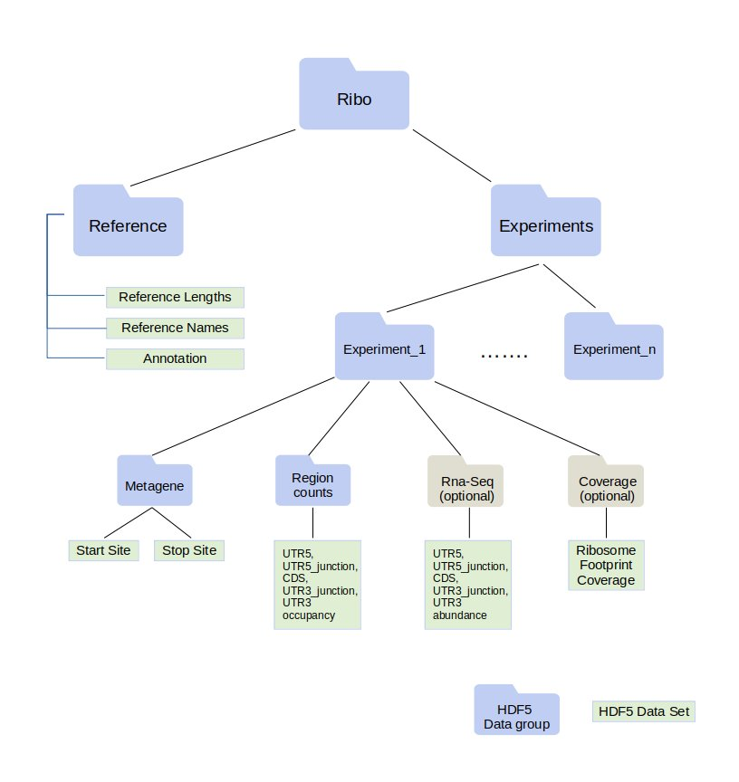
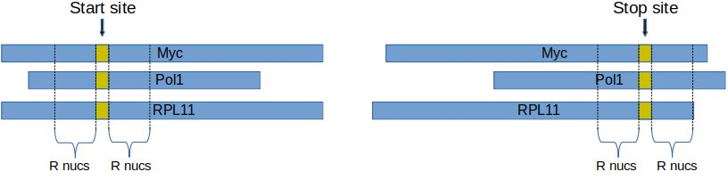
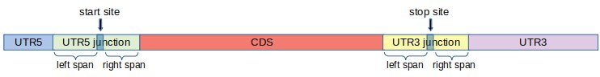

Ribo File Format
================

Ribo files contain ribosome profiling data in a compact form.
Ribo format is built on top of `HDF5 <https://support.hdfgroup.org/HDF5/>`_ .
A ribo file can hold data coming from multiple experiments.

    
    Ribo File Organization

Reference & Annotation
-----------------------

Ribo files work on the transcriptomic coordinates. 
Thus, sequencing data must be mapped to a transcriptome reference 
where each reference entry is a transcript.
Thus, in this context we use the terms 
'transcript' and 'reference' interchangeably. 
Typically, one representative transcript is picked 
for each gene for eukoryatic organisms.

Transcript Lengths
^^^^^^^^^^^^^^^^^^

A ribo file requires a list of the transcript names and transcript lengths.
This information is stored under *reference* data group.

Transcript names and lengths are provided in a tab separated file 
at the creation of a ribo file.
The first column contains transcript names and the second column contains
corresponding transcript lengths.
All data will be stored and reported according to this given transcript order.

Transcript List Example:
     ============    ====
     TRANSCRIPT_1    1512
     TRANSCRIPT_2    1387
     ============    ==== 

All quantified entities (region counts, metagene, ribosome footprint coverage 
and transcript abundance) are stored per transcript.

Annotation
^^^^^^^^^^

*Annotation* of a transcript is the coordinates of the regions
UTR5 (untranslated region on the five prime end), 
CDS (coding sequence) and 
UTR3 (untranslated region on the three prime end).
Annotation information of each transcript is stored in a ribo file where
region boundaries are stored in an array.

Annotation is given in bed file format 
where each region is defined in a separate line.
Regions are defined by specifying their boundaries. 
Note that a bed file is 0-based and the start coordinate is included whereas
the end coordinate is excluded.

Bed file entry to define a region is of the following form.

    ===============  =====  ===  ===========  ==  ==
    TRANSCRIPT_NAME  START  END  REGION_NAME  0   \+
    ===============  =====  ===  ===========  ==  ==
    
In the above entry, the last two columns are not used by RiboPy but
they are still maintained for bed file compatibility.

.. Warning::
   RiboPy is not designed to work with transcripts with no CDS or UTR3
   regions. In other words, all transcripts must have non-zero length 
   CDS and UTR3 regions.
   Therefore the following annotation, in bed format, is **INVALID**
   because no UTR3 region is defined,
     
      ============  ===  ======   =====  ==  ==
      TRANSCRIPT_3  0     700     UTR5    0  \+
      TRANSCRIPT_3  100    1000   CDS     0  \+
      ============  ===  ======   =====  ==  == 
   
.. Warning::
   All nucleotide positions of a transcript must be annotated.
   Equivalently, there can NOT be gaps in the annotation of a transcript.
   Therefore, the following annotation is **INVALID** as 
   the nucleotide positions 32, 33 and 34 don't belong to any region. 
   
       ============  ===  =====   =====  ==  ===
       TRANSCRIPT_1  0     32     UTR5    0  \+
       TRANSCRIPT_1  35    920    CDS     0  \+
       TRANSCRIPT_1  920   1000   UTR3    0  \+
       ============  ===  =====   =====  ==  ===
   
.. Hint::
   It is possible to extract the annotation information from a ribo file.
   For example:
   
   .. code:: bash
   
       ribopy dump annotation sample.ribo 
       
       
Read Length
----------- 

Ribo format allows the user to store ribosome profiling data for a given range
of lengths. If the minimum length is set to N and maximum length is set to M,
then metagene, region counts, coverage and RNA-Seq (if any) data
are stored for each length from N to M (N and M are included).

Note that length is the number of nucleotides of the
ribosome protected RNA footprint.
       
Metagene
--------

Metagene analysis is the study of ribosome footprint coverage around 
transcription start and stop sites.

First, a radius size, r, is fixed. Second, for each transcript, the coverage
data from r nucleotides to the left and to the right side of the
start site is obtained. 
Then, these coverage vectors are summed up to obtain an overall coverage
around start / stop sites.

    
    Metagene for Start and Stop Sites

Region Counts
-------------

Start site is the position of the nucleotide 
on which ribosome starts translation. 
Stop site is the position of the first nucleotide 
on which ribosome terminates translation.
Typically, a transcript can be split into three regions
via start and stop sites: UTR5 ( nucleotides on the 5' end of the start site ),
CDS (nucleotides between start and stop sites) 
and UTR3 (nucleotides to the right of stop site).

For the purpose of calculating ribosome footprints per region,
we define two additional regions around start and stop sites.
The definition of these additional regions also modify the conventional definition
of UTR5, CDS and UTR3.

First we fix two integers **left span** = *l* and **left span** = *r*.

UTR5 Junction:
   This is the part of the transcript consisting of *l* nucleotides
   to the left of the start site and *r* nucleotides to the right
   of the start site, including the start site.

UTR3 Junction:
   This is the part of the transcript consisting of *l* nucleotides
   to the left of the stop site and *r* nucleotides to the right
   of the stop site, including the stop site.
   
Using UTR5 and UTR3 junctions, we re-define UTR5, CDS and UTR3 as follows.

UTR5:
   Nucleotides to the left of UTR5 Junction.

CDS:
   Nucleotides between UTR5 junction and UTR3 junction.

UTR3:
   Nucleotides to the right of UTR3 Junction.

    
    Region Definitions

RNA-Seq
-------

Storing RNA-Seq of an experiment is optional in ribo files.
 
?? More explanation is needed ??

Coverage
--------

This is an optional part of ribo format.

Though metagene and region counts should be sufficient for most analysis,
ribosome footprint coverage per nucleotide position for each length
might be necessary in some cases. So, the user has the option to store
this data in the ribo file. Storing coverage increases the size of the ribo
file significantly,

Metadata
--------

Metadata is a n optional part of ribo format.
During or after the creation of a ribo file, users can provide metadata.

Metadata is provided in pairs of the form **key: value** in 
`yaml <https://docs.ansible.com/ansible/latest/reference_appendices/YAMLSyntax.html>`_ format.

Metadata can be provided for two entities: ribo file and experiment.

Ribo File Metadata
^^^^^^^^^^^^^^^^^^

This is stored at the root data group of the ribo file.
Mapping or pipeline parameters or other metadata common to the experiments
can be stored here.  

Experiment Metadata
^^^^^^^^^^^^^^^^^^^

This part is intended to hold experiment specific metadata such as
cell line, treatment, library preparation method etc.

Ribo File Attributes
--------------------

Upon the creation of a ribo file, the following parameters are stored
and they can NOT be changed thereafter.
These attributes are created by RiboPy and 
they can NOT be specified or changed by the user.

- Metagene Radius
- Left Span & Right Span
- Minimum and Maximum Read Length
- Reference Name

.. Hint::
   These attributes can be viewed using the *info* command.
   
   .. code:: bash
       
        ribopy info sample.ribo 
